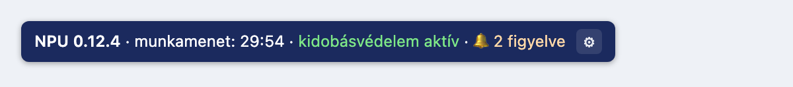
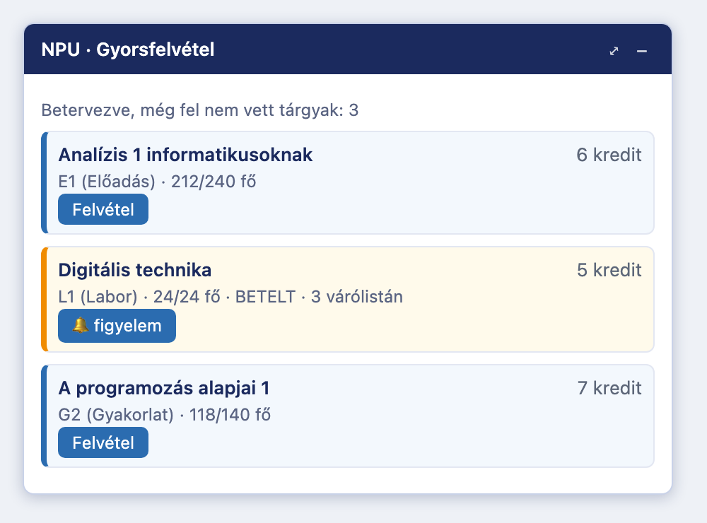
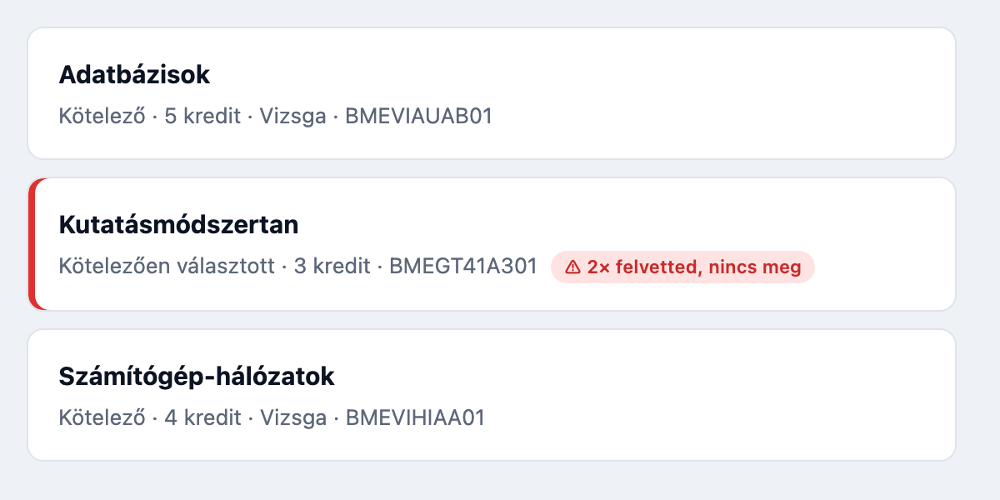

# Neptun PowerUp! NG

**A Neptun, ahogy lennie kellene.** Ingyenes, nyílt forráskódú böngésző-kiegészítő az új Neptun felülethez: nem léptet ki, egy kattintással felveszed a betervezett tárgyaidat, és szól, ha felszabadul egy hely a betelt kurzuson.

**➡️ Telepítés és útmutató: [neptun-powerup.com](https://neptun-powerup.com)**



---

## Telepítés

1. Telepítsd a **Tampermonkey** böngésző-kiegészítőt.
2. Kattints a [telepítő linkre](https://neptun-powerup.com/npu.user.js), és hagyd jóvá.

Részletes, képes útmutató böngészőnként: **[neptun-powerup.com](https://neptun-powerup.com/#telepites)**. A frissítések ezután maguktól érkeznek.

## Mit tud?

**Nem léptet ki.** A Neptun tétlenség miatt kidobna; a PowerUp! a háttérben életben tartja a munkamenetet, amíg nyitva van a lap.

**Egykattintásos tárgyfelvétel.** Az Órarendtervezőbe betervezett tárgyaidat egy panelben látod, létszámmal együtt, és egy kattintással felveheted a betervezett kurzusaival.



**Helyfigyelő.** A betelt kurzusok mellett megjelenik egy „figyelem” gomb. Amint felszabadul egy hely, a böngésző értesítéssel és hangjelzéssel szól — akkor is, ha épp máshol jársz a Neptunban. Kérheted azt is, hogy rögtön fel is vegye.

**Megmutatja, mit felejtesz el.** A tárgyfelvételi listán pirossal jelöli azt a tárgyat, amit korábbi félévben már felvettél, de nem teljesítettél. Így a pótlandó tárgy nem vész el a többi ötven között.



**És még:** automatikus tárgylistázás, színezett vizsga-áttekintés, automatikus belépés, félévválasztó-memória, felugró ablakok elnyelése, beszédes böngészőfül-cím, mozgatható panelek.

Minden funkció külön ki- és bekapcsolható a jobb alsó jelvény ⚙ gombjával.

## Melyik egyetemen működik?

**23 magyar intézmény** Neptunját ellenőriztem: mindegyiken elindul és felismeri a felületet — BME, Debrecen, Szeged, Miskolc, Óbudai, Pannon, Semmelweis, MATE, NKE, PPKE, Károli, Széchenyi, Metropolitan, MOME, Nyíregyháza, Neumann János és mások.

A **funkciókat** végig eddig a BME-n teszteltem, máshol eltérés előfordulhat. Ha kipróbálod, [írd meg, mit tapasztaltál](https://neptun-powerup.com/visszajelzes) — ez a leghasznosabb, amivel segíthetsz.

## Biztonságos?

Kizárólag a böngésződben fut, és **semmilyen adatot nem küld külső szerverre**. Minden beállítás a saját gépeden marad. A forráskód nyílt, bárki átnézheti.

Egy figyelmeztetés: ha bekapcsolod az automatikus belépést, a jelszavad a gépeden, titkosítás nélkül tárolódik. Csak olyan gépen használd, amelyhez más nem fér hozzá.

## A projektről

Az eredeti [Neptun PowerUp!](https://github.com/solymosi/npu)-ot **Solymosi Máté** készítette, és 2011-től 2024-ig, tizenhárom éven át gondozta, több mint 15 ezer hallgató életét könnyítve meg vele. Ez a projekt az ő munkájának szellemi utódja: minden inspiráció tőle származik. Köszönöm, Máté!

Az NG változat **AI-asszisztált fejlesztéssel** készült: az új Neptun felület feltérképezését, a kód megírását és a tesztelést mesterséges intelligencia (Claude) végezte, emberi irányítás mellett.

Ingyenes és az is marad. Ha hasznosnak találod, [meghívhatsz egy kávéra](https://buymeacoffee.com/neptunpowerup).

Nem hivatalos projekt: nem áll kapcsolatban az SDA Informatikával és az egyetemekkel.

## Fejlesztőknek

<details>
<summary>Build, tesztek, felépítés</summary>

```bash
npm install
npm run build      # dist/npu.user.js
npm run build:site # + site/npu.user.js és site/demo.js (a weboldal bemutatói)
npm run watch      # újrabuild minden változtatásra
npm test           # build:site + a teljes tesztkészlet
npm run typecheck
git config core.hooksPath .githooks   # egyszer: push előtt automatikusan npm test
```

A szkript TypeScriptben készül, esbuilddel egyetlen userscript-fájlba fordul. A `src/core/` a közös réteg (API-kliens, tárolás, útvonalak, DOM-segédek), a `src/modules/` alatt egy fájl egy funkció.

A weboldal bemutatói (a panel, a jelvény, a verziószám) nem kézzel másolt HTML: a `src/site/demo.ts` a szkript valódi komponenseiből építi őket a build során, ezért ami a szkripten változik, az a következő kiadással a weboldalon is változik. A `test/site.test.mjs` ellenőrzi, hogy a kettő egyezik, és a pre-push hook nem enged pusholni, ha nem.

A Neptun az új felületen REST API-t használ; a felderített végpontokat a [RECON.md](RECON.md) írja le. A `site/` a projekt weboldala, a `worker/` a visszajelzés-űrlapot kiszolgáló Cloudflare Worker — üzemeltetés: [DEPLOY.md](DEPLOY.md).

</details>

## Licenc

MIT
